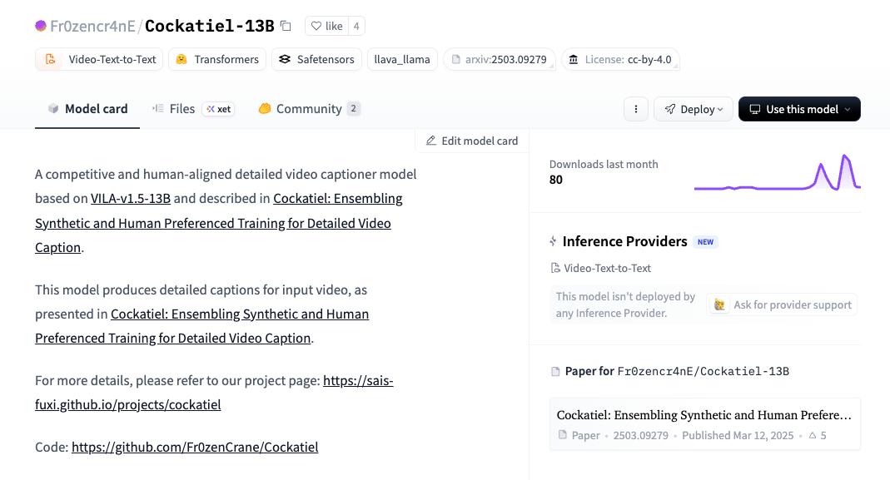
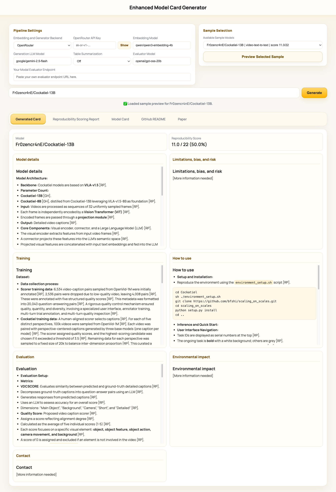
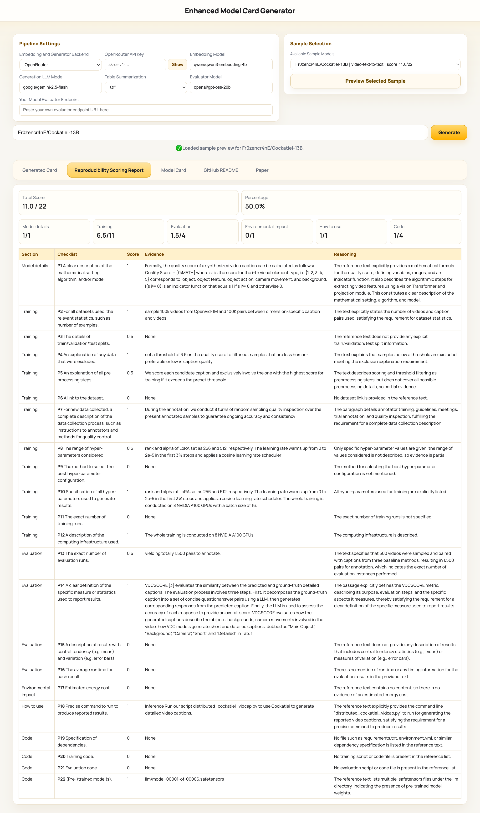
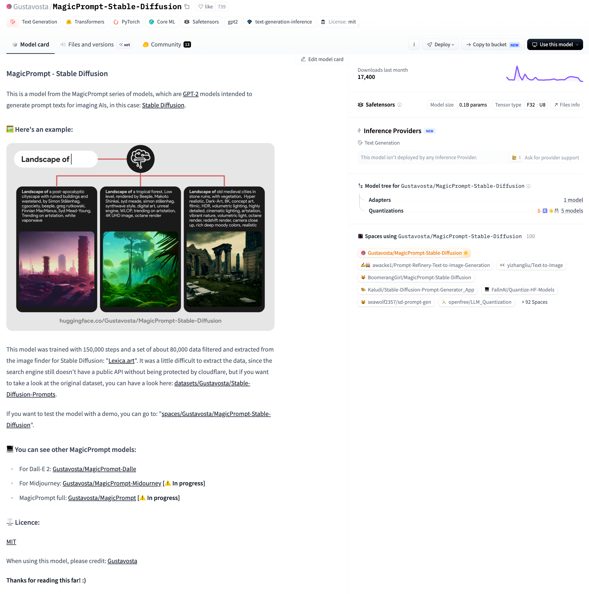
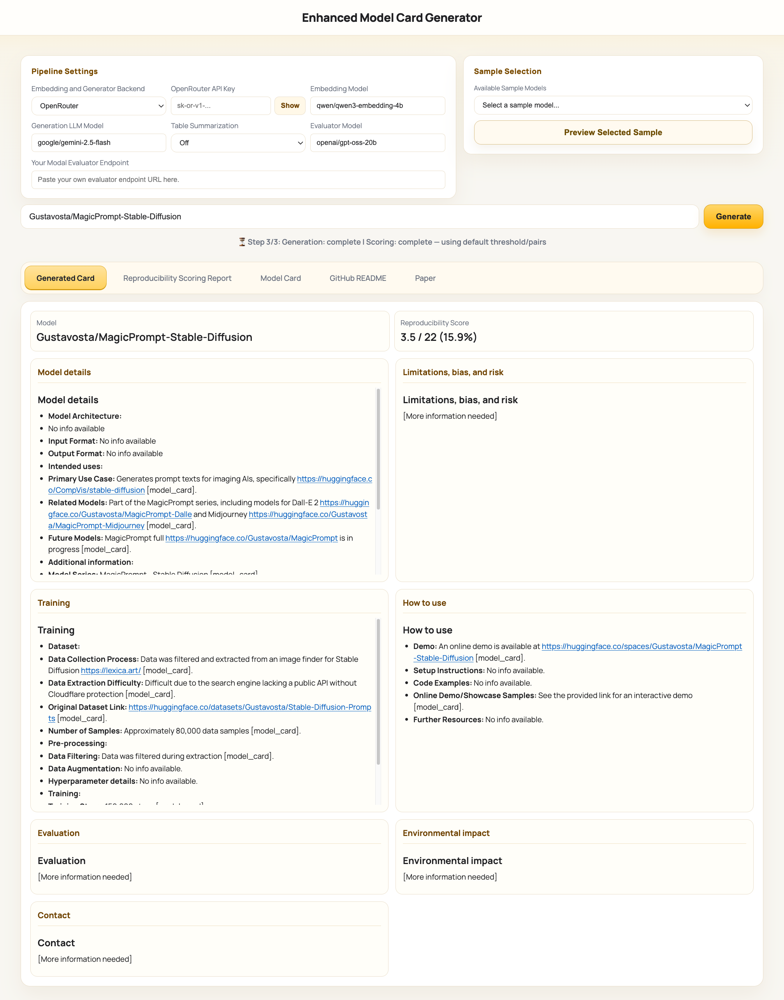
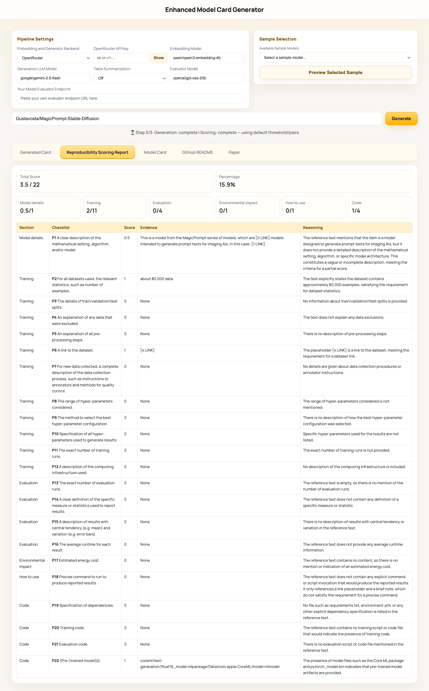

# Supplementary Material

## Case 1: Repository with all artifacts

This example shows a repository where the extractor recovered the paper, the GitHub README, and the original model card.
Original repository: [Fr0zencr4nE/Cockatiel-13B](https://huggingface.co/Fr0zencr4nE/Cockatiel-13B)

### Original Model Card

### Enhanced Model Card

### Reproducibility Report

## Case 2: Repository with only the original model card

This example shows a repository where only the original model card was available for extraction.
Original repository: [Gustavosta/MagicPrompt-Stable-Diffusion](https://huggingface.co/Gustavosta/MagicPrompt-Stable-Diffusion)

### Original Model Card

### Enhanced Model Card

### Reproducibility Report
